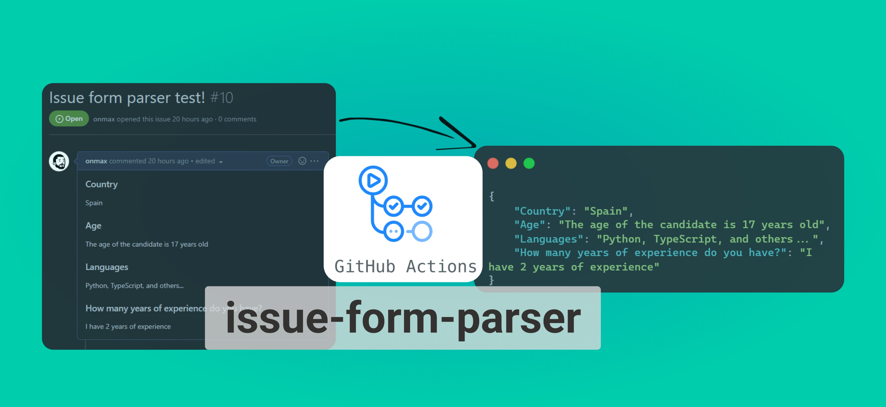

<p align="center">
  <a href="https://github.com/onmax/issue-form-parser/actions"></a>
</p>

# Issue Form Parser - GitHub Action

Convert GitHub Form Issues into JSON objects with this simple Action.



---

## Description

This GitHub Action allows you to easily convert GitHub issues into JSON objects, making it simple to work with and manipulate issue data in your workflow. With just a few simple steps, you can use this action to automatically convert an issue into a JSON object, which can then be used for a variety of purposes, such as data analysis, reporting, or integration with other systems. This action is designed to be flexible and easy to use, so you can quickly and easily convert issues into JSON format without any hassle.

## Parameters

<!-- table with input name, required, description -->

| Name | Required | Description |
| ------------- | ------------- | ------------- |
| `issue_number` | `true` | The issue number to parse. |
| `github_token` | `false` | The GitHub token to use for authentication and fetching the issue. Defaults to the `GITHUB_TOKEN` secret. |

## Usage

First, you need to create a GitHub Issue Form. You can read more about it [here](https://docs.github.com/en/communities/using-templates-to-encourage-useful-issues-and-pull-requests/syntax-for-issue-forms).

Then, you need to create a workflow file and include the following step:

```yaml
steps:
  - name: Parse issue
    id: parse
    uses: onmax/issue-form-parser@v1.0.0
    with:
      issue_number: ${{ github.event.issue.number }}

  # Examples on how to use the output
  - name: Show parsed payload
    run: |
      echo "${{ toJson(steps.parse.outputs.payload) }}"
  - name: Show 'Name' field
    run: |
      echo "${{ steps.parse.outputs.payload['Name'] }}"
```

## ⚠️ Limitations

- The action only works with issues, not pull requests.
- **The `issue_number` input is required.** If the event that trigger the workflow is not an issue, you need to specify the issue number manually.
- **The returned `payload` is a string.** You need to use `toJson` to convert it to a JSON object. Read more about [GitHub Actions expressions](https://docs.github.com/en/actions/learn-github-actions/expressions#tojson).
- Checkboxes are not supported. If you need to use checkboxes, you can create a PR or use the [`peter-murray/issue-forms-body-parser@v3.0.0`](https://github.com/peter-murray/issue-forms-body-parser)

## Example

This issue:

```md
### Country

Spain

### Age

The age of the candidate is 17 years old

### Languages

Python, TypeScript, and others...

### How many years of experience do you have?

I have 2 years of experience
```

Will be converted to:

```json
{
  "Country": "Spain",
  "Age": "The age of the candidate is 17 years old",
  "Languages": "Python, TypeScript, and others...",
  "How many years of experience do you have?": "I have 2 years of experience"
}
```

## Acknowledgements

- Based on the previous work of [Peter Murray](https://github.com/peter-murray/issue-forms-body-parser)
- This template was created using the [TypeScript Action Template](https://github.com/actions/typescript-action)